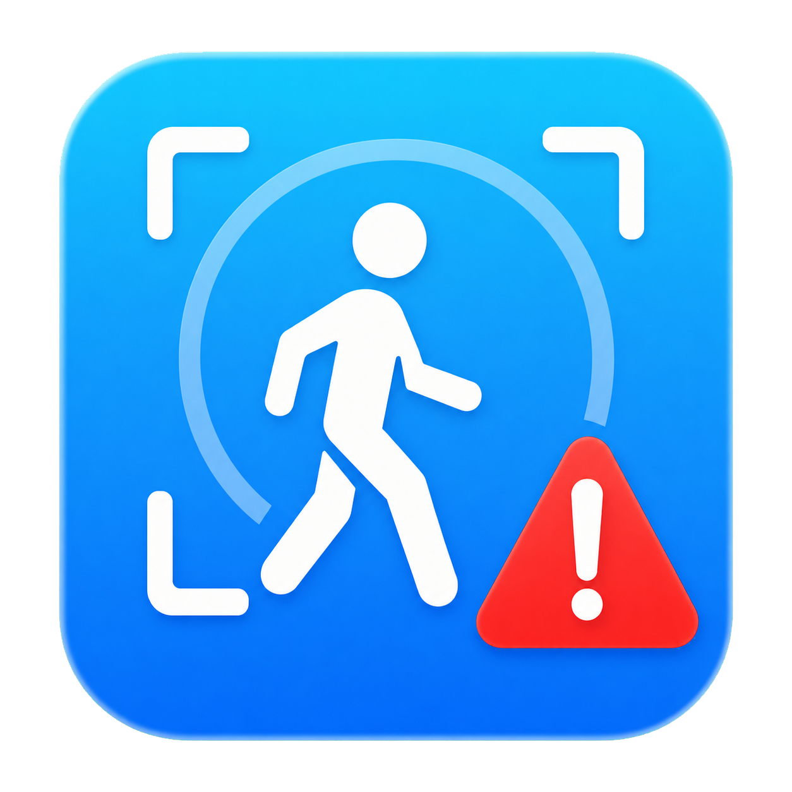

# 🚨 AlertZone

<div align="center">
    
</div>

<div align="center">
    <p style="font-size: 30px; font-weight: 700; margin: 10px 0 0;">
        AlertZone
    </p>
    <p>本地人体检测 · 区域监控 · 局域网告警</p>
</div>

## 🔍 概述

AlertZone 是一个基于摄像头的本地人体检测与告警工具。它使用 YOLO 检测画面中的 `person` 类别，通过 ByteTrack 维持视频流中的临时跟踪编号，并提供 PySide6 桌面界面与局域网告警页面。

该项目主要用于：

- 实时检测并跟踪摄像头画面中的人物
- 框选指定区域，只对进入区域的人物计数和告警
- 在同一局域网的手机或电脑上查看状态与实时预览
- 在人物持续出现后触发网页警告并保留事件截图

> AlertZone 不进行人脸检测、人脸识别或身份识别，画面中的编号仅用于当前视频流内的临时跟踪。

## ✨ 功能

### 桌面端

- 自动扫描并切换可用摄像头
- 支持 `640×360`、`1280×720` 和 `1920×1080` 请求分辨率
- 实时显示人体框、临时编号、人数与 FPS
- 支持镜像画面、浅色/黑色主题和置顶小窗口
- 可在画面中拖拽设置识别区域
- 自动保存摄像头、画质、镜像、主题、局域网开关、识别区域和窗口尺寸

### 局域网页面

- 查看检测状态、人数、FPS 和人物持续在场时间
- 按需开启带检测框的 MJPEG 实时预览
- 支持红色、黄色、人物放大和告警实时预览等警告方式
- 可设置 `0`、`0.2`、`0.5`、`1` 或 `2` 秒告警确认时间
- 支持连续检测、手动退出和延时自动退出警告
- 告警时显示触发事件中的人物截图
- 网页主题和警告配置独立保存在浏览器中

## 📦 安装

### 系统要求

- **操作系统**：Windows 或 macOS
- **Python**：推荐 Python 3.11 或 3.12
- **硬件**：可用摄像头
- **网络**：仅在需要局域网页面时使用

### 1. 创建虚拟环境

使用 Conda：

```bash
conda create -n AlertZone python=3.12
conda activate AlertZone
```

或使用 Python 自带的 `venv`。

macOS / Linux：

```bash
python3 -m venv .venv
source .venv/bin/activate
```

Windows PowerShell：

```powershell
py -m venv .venv
.\.venv\Scripts\Activate.ps1
```

### 2. 安装依赖

```bash
python -m pip install --upgrade pip
python -m pip install -r requirements.txt
```

如果运行时提示缺少 `lap`，请补充安装：

```bash
python -m pip install lapx
```

### 3. 启动程序

请在项目根目录运行：

```bash
python src/AlertZone_app.py
```

项目已包含 `src/yolo11n.pt` 模型文件，无需在每次启动时重新下载。

## 🚀 使用说明

### 基本操作

1. 选择摄像头和画质，按需开启镜像。
2. 点击“开始检测”，等待模型和摄像头初始化。
3. 查看画面中的人体框、临时编号、人数和 FPS。
4. 点击“停止”释放摄像头并结束本轮检测。

### 设置识别区域

1. 点击“范围识别”。
2. 在摄像头画面中拖拽出黄色区域。
3. 只有人体框中心点位于区域内的人物才会参与计数、持续时间统计、告警和截图。
4. 再次关闭“范围识别”即可恢复全画面检测。

局域网普通预览和告警实时预览也会同步裁切到所选区域。

### 使用小窗口

点击“小窗口”后，程序会隐藏控制栏和状态栏，只保留置顶检测画面。将鼠标移入画面可使用悬浮的开始/停止按钮，双击画面恢复普通窗口。

### 打开局域网告警页面

1. 保持桌面端的“局域网连接”开关打开。
2. 在窗口左下角找到局域网地址，例如：

   ```text
   http://192.168.1.20:8765
   ```

3. 让手机或另一台电脑连接同一局域网。
4. 在浏览器中打开该地址，并按需启用警告、连续检测和实时预览。

网页只读取桌面程序发布的状态和画面，不会重复打开摄像头或运行第二个 YOLO 实例。关闭局域网连接不会停止本地检测。

## 🛠️ 开发与构建

### 项目文件

- `src/AlertZone_app.py`：桌面界面、人体检测、跟踪和局域网服务
- `src/web/index.html`：局域网状态与告警页面
- `src/yolo11n.pt`：YOLO 人体检测模型
- `src/dev_preview.py`：开发阶段的界面自动重启脚本
- `icon/`：Windows、macOS 和运行时图标
- `requirements.txt`：Python 运行依赖

### 源码调试

主程序入口：

```bash
python src/AlertZone_app.py
```

自动刷新预览：

```bash
python src/dev_preview.py
```

项目使用的核心组件：

- [Ultralytics YOLO](https://github.com/ultralytics/ultralytics)：人体检测
- [ByteTrack](https://github.com/ifzhang/ByteTrack)：临时目标跟踪
- [PySide6](https://doc.qt.io/qtforpython-6/)：桌面界面
- [OpenCV](https://opencv.org/)：摄像头读取与图像处理

### 打包说明

AlertZone 使用 PyInstaller 打包。PyInstaller 不是跨平台编译器：Windows 版必须在 Windows 中构建，macOS 版必须在 macOS 中构建。建议使用 64 位 Python 3.11，并先验证文件夹版，再尝试单文件版。

#### 打包前检查

发布包需要包含以下资源：

```text
AlertZone/
├── requirements.txt
├── icon/
│   ├── icon.png
│   ├── icon.ico
│   └── icon.icns
└── src/
    ├── AlertZone_app.py
    ├── dev_preview.py
    ├── yolo11n.pt
    └── web/
        └── index.html
```

PyInstaller 会把 `--add-data` 指定的资源放进应用包。程序必须相对于 `__file__` 查找这些资源，而不能依赖启动时的工作目录。打包前请确认 `src/AlertZone_app.py` 使用以下方式定位模型：

```python
APP_ROOT = Path(__file__).resolve().parent
MODEL_PATH = APP_ROOT / "yolo11n.pt"
```

并将模型加载代码改为：

```python
model = YOLO(str(MODEL_PATH))
```

当前程序中的图标和网页目录已经使用 `APP_ROOT` 定位；模型路径也完成上述调整后，源码、文件夹版和单文件版才能共用同一套资源查找逻辑。

每次正式打包前先运行源码：

```bash
python src/AlertZone_app.py
```

实际检查摄像头、人体框、ByteTrack 编号、范围识别、局域网页面和实时预览均可正常工作，再继续打包。

### Windows 打包

#### 1. 准备环境

在 64 位 Windows 10 或 Windows 11 上安装 Python 3.11。安装 Python 时建议勾选“Add Python to PATH”。将项目放到本地磁盘，例如 `D:\AlertZone`，然后打开 PowerShell，并进入项目根目录（不能停留在 `src` 目录）：

```powershell
Set-Location "D:\AlertZone"
py -3.11 -m venv .venv-build
.\.venv-build\Scripts\Activate.ps1
python -m pip install --upgrade pip setuptools wheel
python -m pip install -r requirements.txt
python -m pip install lapx
python -m pip install --upgrade pyinstaller pyinstaller-hooks-contrib
```

如果目标电脑只使用 CPU，可在安装项目依赖前，按照 PyTorch 官网为 Windows 选择 CPU 版本；如果需要 NVIDIA GPU，则必须根据目标显卡、驱动和 CUDA 环境选择对应的 PyTorch 版本。不要把开发电脑上未经确认的 CUDA 环境直接作为通用发布包。

确认关键依赖可以导入：

```powershell
python -c "import cv2, torch, ultralytics, PySide6; print('Dependencies OK')"
python src\AlertZone_app.py
```

#### 2. 构建文件夹版（推荐）

在 PowerShell 中运行。每行末尾的反引号 `` ` `` 是 PowerShell 续行符，其后不能再有空格：

```powershell
python -m PyInstaller `
  --noconfirm `
  --clean `
  --windowed `
  --onedir `
  --name AlertZone `
  --icon "icon\icon.ico" `
  --add-data "icon\icon.png:icon" `
  --add-data "src\yolo11n.pt:." `
  --add-data "src\web:web" `
  --collect-all ultralytics `
  --copy-metadata ultralytics `
  src\AlertZone_app.py
```

生成结果：

```text
dist\AlertZone\AlertZone.exe
```

先从 PowerShell 启动一次，便于观察错误：

```powershell
.\dist\AlertZone\AlertZone.exe
```

再通过资源管理器双击测试。发布文件夹版时必须发送整个 `dist\AlertZone` 文件夹，不能只复制其中的 `AlertZone.exe`。

可以使用 PowerShell 压缩发布目录：

```powershell
Compress-Archive -Path .\dist\AlertZone -DestinationPath .\AlertZone-Windows-x64.zip -Force
Get-FileHash .\AlertZone-Windows-x64.zip -Algorithm SHA256
```

#### 3. 构建单文件版（可选）

确认文件夹版完全正常后，将 `--onedir` 改为 `--onefile`：

```powershell
python -m PyInstaller `
  --noconfirm `
  --clean `
  --windowed `
  --onefile `
  --name AlertZone `
  --icon "icon\icon.ico" `
  --add-data "icon\icon.png:icon" `
  --add-data "src\yolo11n.pt:." `
  --add-data "src\web:web" `
  --collect-all ultralytics `
  --copy-metadata ultralytics `
  src\AlertZone_app.py
```

生成结果：

```text
dist\AlertZone.exe
```

单文件版包含 PySide6、PyTorch、Ultralytics 和模型，体积较大；每次启动还需要先释放运行文件，因此通常比文件夹版慢。未签名的程序也可能触发 SmartScreen 或杀毒软件提示。正式公开分发时，建议使用可信的 Authenticode 代码签名证书签署最终 `.exe`。

### macOS 打包

#### 1. 确认处理器架构

先确认构建机器架构：

```bash
uname -m
```

- 输出 `arm64`：Apple Silicon Mac
- 输出 `x86_64`：Intel Mac

PyInstaller 默认构建当前 Python 和当前机器架构的应用。由于 PyTorch 等依赖对通用二进制的支持有限，推荐分别在 Apple Silicon 和 Intel 环境中构建两个版本，不要直接把单一架构应用标记为 `universal2`。

#### 2. 准备环境

在终端进入项目目录并创建独立环境：

```bash
cd "/path/to/AlertZone"
python3.11 -m venv .venv-build
source .venv-build/bin/activate
python -m pip install --upgrade pip setuptools wheel
python -m pip install -r requirements.txt
python -m pip install lapx
python -m pip install --upgrade pyinstaller pyinstaller-hooks-contrib
```

确认 Python 与依赖架构一致，并测试源码：

```bash
python -c "import platform; print(platform.machine())"
python -c "import cv2, torch, ultralytics, PySide6; print('Dependencies OK')"
python src/AlertZone_app.py
```

首次运行时，在“系统设置 → 隐私与安全性 → 摄像头”中允许当前终端访问摄像头。

#### 3. 构建 `.app` 文件夹版（推荐）

```bash
python -m PyInstaller \
  --noconfirm \
  --clean \
  --windowed \
  --onedir \
  --name AlertZone \
  --icon "icon/icon.icns" \
  --osx-bundle-identifier "com.hknight.alertzone" \
  --add-data "icon/icon.png:icon" \
  --add-data "src/yolo11n.pt:." \
  --add-data "src/web:web" \
  --collect-all ultralytics \
  --copy-metadata ultralytics \
  src/AlertZone_app.py
```

生成结果：

```text
dist/AlertZone.app
```

#### 4. 写入 macOS 隐私权限说明

程序启动后会立即扫描摄像头。如果应用的 `Info.plist` 缺少摄像头用途说明，macOS 会直接终止程序，表现为双击后没有窗口或闪退。每次重新打包后都必须执行：

```bash
/usr/libexec/PlistBuddy \
  -c "Add :NSCameraUsageDescription string AlertZone 需要访问摄像头以进行本地人体检测与区域告警。" \
  "dist/AlertZone.app/Contents/Info.plist"

/usr/libexec/PlistBuddy \
  -c "Add :NSLocalNetworkUsageDescription string AlertZone 需要访问本地网络，以便局域网设备查看检测状态与告警页面。" \
  "dist/AlertZone.app/Contents/Info.plist"
```

修改 `Info.plist` 后原签名会失效。本机测试时重新进行临时签名：

```bash
codesign --force --deep --sign - "dist/AlertZone.app"
codesign --verify --deep --strict --verbose=2 "dist/AlertZone.app"
open "dist/AlertZone.app"
```

如果重复执行时提示键已经存在，请将对应命令中的 `Add` 改为 `Set`。

### 常见打包问题

- **双击后立即退出**：临时移除 `--windowed` 后重新构建，从终端运行并查看完整错误。
- **找不到 `yolo11n.pt`**：确认模型通过 `APP_ROOT / "yolo11n.pt"` 定位，并保留 `--add-data "src/yolo11n.pt:."`。
- **找不到 `web/index.html` 或图标**：检查 `--add-data "src/web:web"`、图标参数和应用包中的资源目录。
- **提示缺少 `lap`**：在打包环境执行 `python -m pip install lapx` 后清理并重新构建。
- **缺少 Ultralytics 模块或配置文件**：升级 PyInstaller hooks，并保留 `--collect-all ultralytics` 与 `--copy-metadata ultralytics`。
- **Windows 无法打开摄像头**：检查系统摄像头隐私权限，并确认摄像头未被其他软件占用。
- **macOS 没有摄像头权限提示**：检查 `Info.plist` 是否包含 `NSCameraUsageDescription`，修改后必须重新签名。
- **手机无法访问网页**：确认设备位于同一局域网，允许防火墙入站连接，并检查路由器是否启用访客网络隔离。
- **单文件版启动很慢**：这是 PyTorch、Qt 和模型释放到临时目录造成的；优先发布文件夹版。

相关文档：[PyInstaller 使用参数](https://pyinstaller.org/en/stable/usage.html)、[PyInstaller 运行时资源路径](https://pyinstaller.org/en/stable/runtime-information.html)、[Apple Developer ID 与公证](https://developer.apple.com/developer-id/)。

## ⚠️ 已知限制

- 只检测通用的 `person` 类别，不识别人脸或真实身份
- ByteTrack 编号是临时编号；人物离开、遮挡或重新进入后编号可能改变
- 检测准确率和速度受光照、遮挡、摄像头画质及电脑性能影响
- 网页服务没有身份验证，端口 `8765` 只应在可信的家庭或办公局域网中使用
- macOS 首次运行需要在“系统设置 → 隐私与安全性 → 摄像头”中授予终端或编辑器摄像头权限


---

<div align="center">
    <p>AlertZone - ©️H-Knight</p>
</div>
